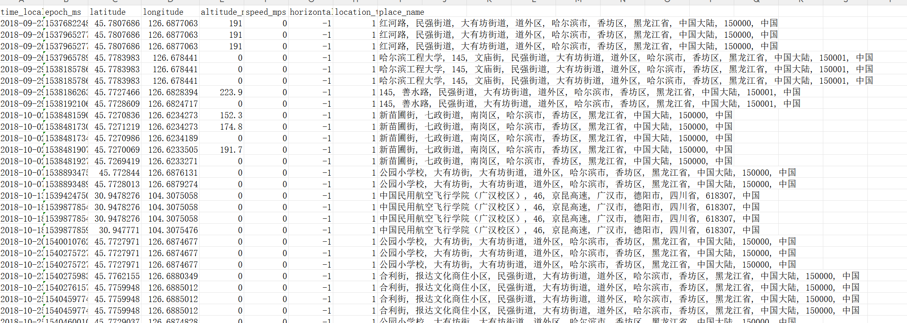
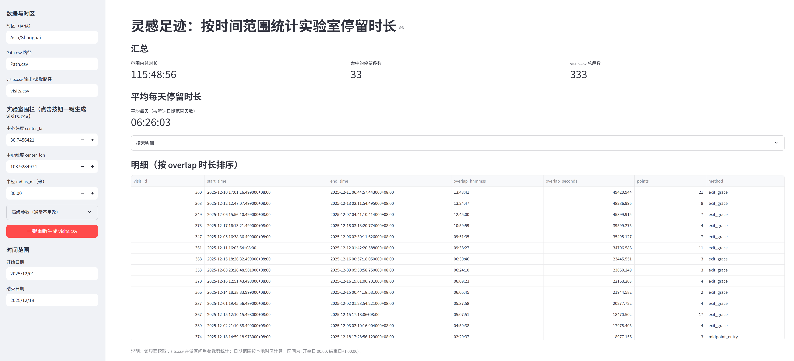

# 灵感足迹 CSV转换工具与停留时长统计

把“灵感足迹”APP 导出的 `Path.csv` 转换成可读数据，并支持：

- **轨迹概览/导出**：时间范围、采样间隔、导出 `readable.csv`
- **逆地理编码（可选）**：经纬度 → 地名/地址（带缓存、可并发、可中断恢复）
- **实验室停留统计**：自动识别停留段 `visits.csv`、支持手工校正、按时间范围裁剪统计
- **可视化界面（可选）**：选择日期范围实时统计 + 平均每天停留时长 + 一键重新生成 `visits.csv`

---

### 示例截图



界面能力：

- 左侧可填 **实验室经纬度/半径**，点击按钮一键重新生成 `visits.csv`
- 选择 **开始/结束日期** 实时显示：
  - 范围内总停留时长
  - 平均每天停留时长
  - 按天明细 + 停留段明细


---


### 数据字段说明（`Path.csv`）

每行是一条定位点（轨迹点），常用字段：

- **`geoTime`**：Unix epoch **毫秒**时间戳（例如 `1766050136129`）
- **`latitude` / `longitude`**：经纬度（十进制度）
- 其他字段：海拔、速度、精度、网络、定位类型等

---

### 环境要求

- **Python 3.10+**（你当前使用 3.13 也 OK）

---

## 快速开始（无需安装依赖）

在项目目录（包含 `Path.csv`）直接运行：

```bash
python -m path_analyze inspect --csv Path.csv --tz Asia/Shanghai
```

## 示例数据（可公开、随机生成）

为了方便他人测试，本仓库提供一个**随机模拟**的轨迹文件（字段与真实导出一致）：

- `sample_data/Path.csv`

也提供生成脚本（可生成任意行数、可复现）：

```bash
python scripts/generate_sample_path_csv.py --out sample_data/Path.csv --rows 2000 --seed 42
```

用示例数据跑通：

```bash
python -m path_analyze inspect --csv sample_data/Path.csv --tz Asia/Shanghai
python -m path_analyze export-readable --csv sample_data/Path.csv --out readable.csv --tz Asia/Shanghai
```

---

## 1) 导出可读轨迹（`readable.csv`）

```bash
python -m path_analyze export-readable --csv Path.csv --out readable.csv --tz Asia/Shanghai
```

输出包含 `time_local`（本地可读时间）等列。

---

## 2) （可选）逆地理编码：经纬度 → 地名（`place_name`）

启用逆地理编码并写入 `readable.csv` 的 `place_name` 列：

```bash
python -m path_analyze export-readable --csv Path.csv --out readable.csv --tz Asia/Shanghai --geocode
```

### 缓存与中断恢复（强烈建议了解）

- **`geocode_cache.json`**：缓存快照（json）
- **`geocode_cache.journal.jsonl`**：增量日志（jsonl，程序中途退出也不会丢进度；下次运行会自动回放合并）

> 这两个文件在 `.gitignore` 里，**不要提交到 GitHub**（文件可能很大）。

### 去重（减少请求，适配 GPS 抖动）

- **`--geocode-precision`**：缓存 key 的小数位（默认 4）
- **`--geocode-dedup-precision`**：更粗粒度复用（例如 3），对抖动点非常有效

示例：

```bash
python -m path_analyze export-readable --csv Path.csv --out readable.csv --geocode \
  --geocode-precision 4 --geocode-dedup-precision 3 --geocode-every-n 3
```

### 并发加速（网络延迟高时有效）

如果单次请求经常很慢（5~20s），可以让多个请求同时在途（主进程仍按 `--geocode-min-interval` 控制提交频率）：

```bash
python -m path_analyze export-readable --csv Path.csv --out readable.csv --geocode \
  --geocode-workers 8 --geocode-executor thread --geocode-min-interval 1
```

也支持多进程：

```bash
python -m path_analyze export-readable --csv Path.csv --out readable.csv --geocode \
  --geocode-workers 8 --geocode-executor process --geocode-min-interval 1
```

### 重要注意（公共服务限速/封禁风险）

默认使用 OpenStreetMap Nominatim。公共服务通常有使用政策/限速要求：

- **建议把 `--geocode-min-interval` 设为 >= 1.0**
- 也建议设置清晰的 `--geocode-user-agent`（标识用途/作者）

> 如果你的 APP 导出坐标不是 WGS84（国内常见 GCJ-02），地名可能偏移；需要的话可以继续扩展“坐标系纠偏”。

---

## 3) 统计“实验室”停留时长（生成 `visits.csv`）

你需要提供实验室围栏：

- **中心点**：`--center-lat` / `--center-lon`
- **半径（米）**：`--radius-m`

示例：

```bash
python -m path_analyze find-visits --csv Path.csv \
  --center-lat 30.7456421 --center-lon 103.9284974 --radius-m 80 \
  --out visits.csv --tz Asia/Shanghai
```

### 参数说明（解决“被切成几分钟”的关键）

- **`--max-gap-seconds`**：连续“在围栏内”的采样间隔超过该值才强制切分（默认 12 小时，适配稀疏采样）
- **`--exit-grace-seconds`**：连续在围栏外超过该值才算离开（默认 5 分钟，防 GPS 抖动）
- **`--transition-gap-seconds`**：进/出边界用“中点估计”的最大间隔（默认 10 分钟）

---

## 4) 手工校正 `visits.csv` 并汇总

你可以直接编辑 `visits.csv` 的 `start_time` / `end_time` 进行校正，然后汇总：

```bash
python -m path_analyze sum-visits --visits visits.csv --tz Asia/Shanghai
```

---

## 5) 只统计某个时间范围（命令行）

只识别某段时间内的停留（对原始轨迹点做过滤）：

```bash
python -m path_analyze find-visits --csv Path.csv --center-lat ... --center-lon ... --radius-m 80 \
  --range-start "2025-12-01 00:00:00" --range-end "2025-12-31 23:59:59"
```

对 `visits.csv` 做“范围裁剪后汇总”（只统计重叠部分）：

```bash
python -m path_analyze sum-visits --visits visits.csv \
  --range-start "2025-12-01 00:00:00" --range-end "2025-12-31 23:59:59"
```

---

## 6) 可视化界面（Streamlit）

### 安装 UI 依赖

```bash
pip install ".[ui]"
```

### 启动

```bash
streamlit run streamlit_app.py
```

## License

MIT License（见 `LICENSE`）
